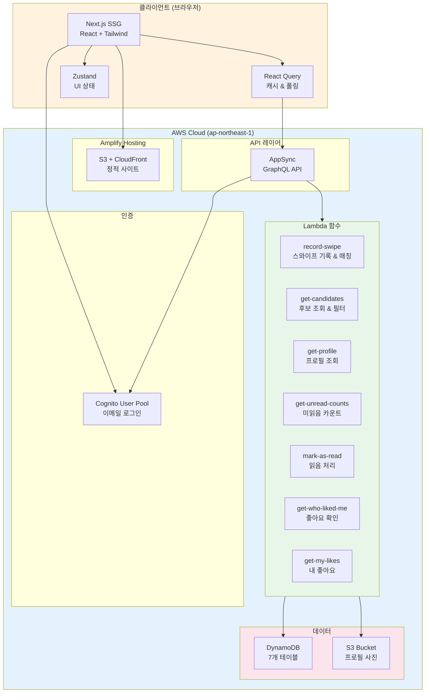
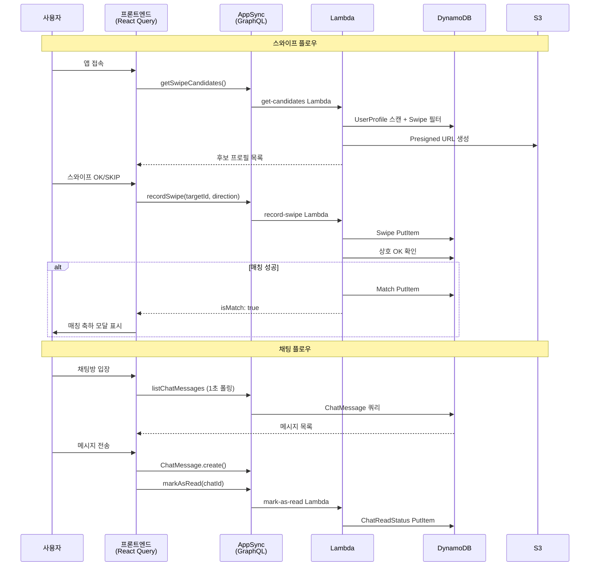
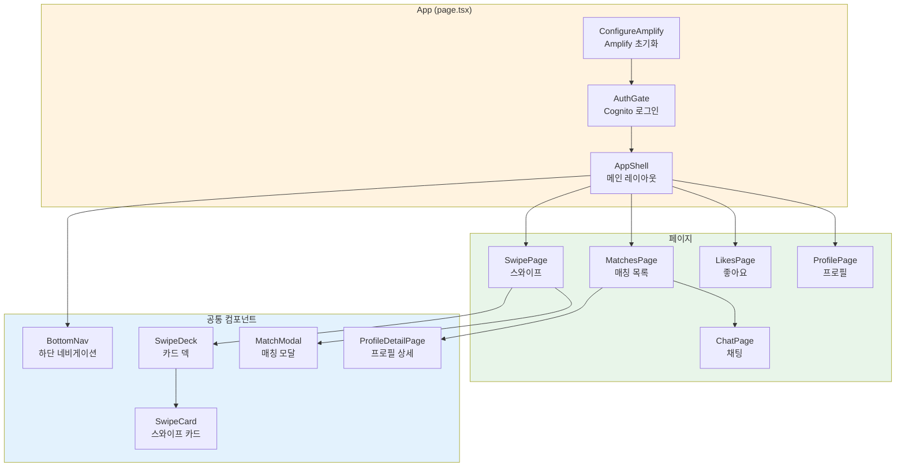
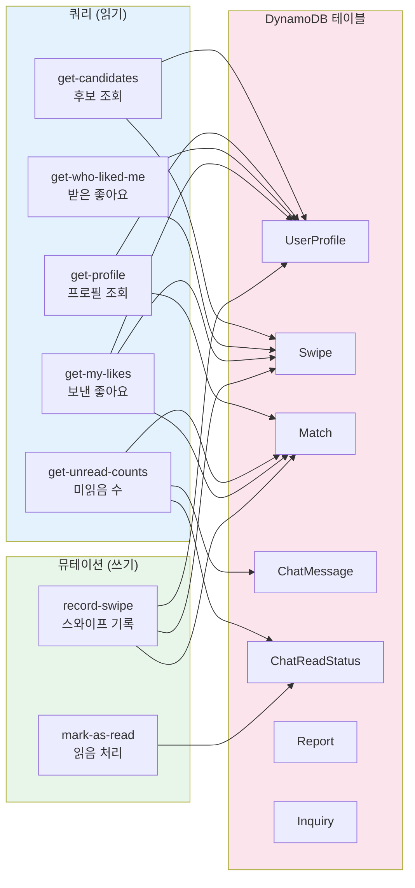
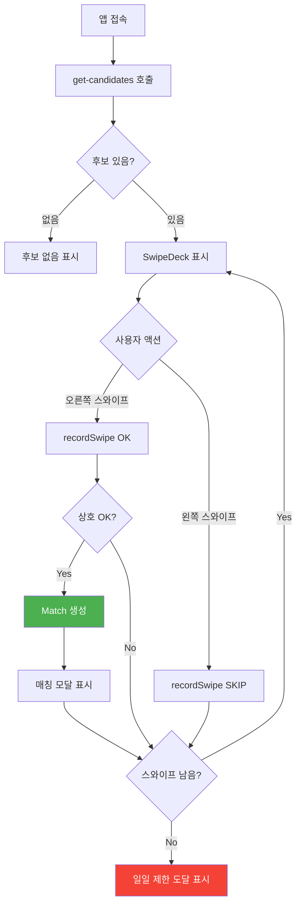
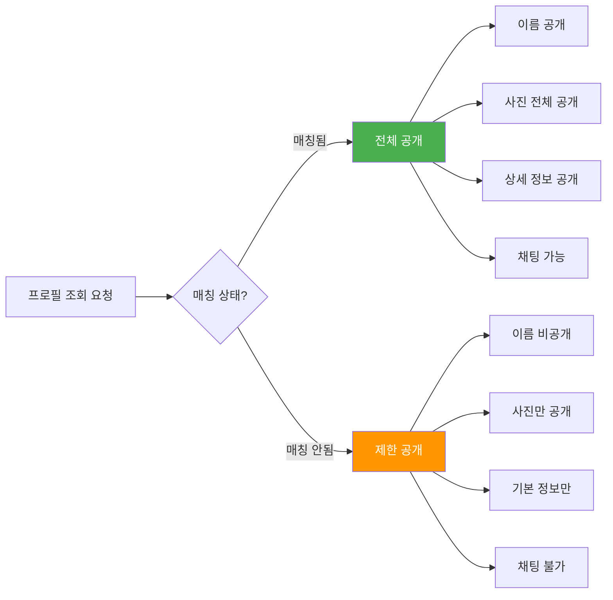
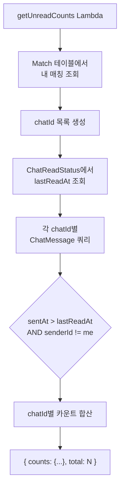
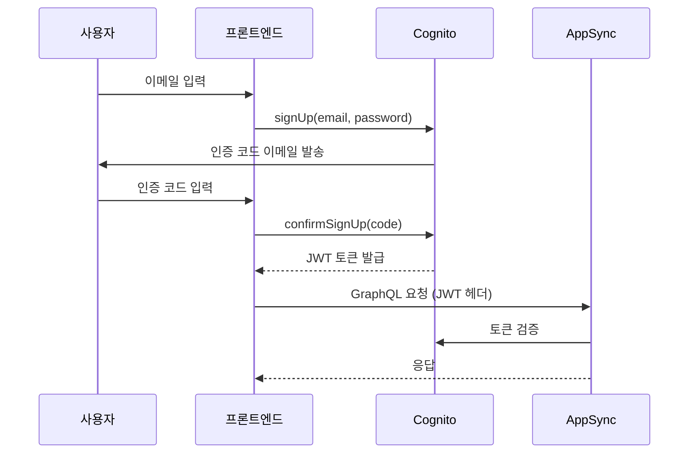
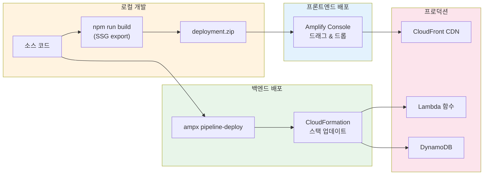

# Lunch Pair - 아키텍처 문서

> 사내 점심 매칭 앱 (틴더 스타일 POC)

## 목차

- [프로젝트 개요](#프로젝트-개요)
- [기술 스택](#기술-스택)
- [시스템 아키텍처](#시스템-아키텍처)
- [프론트엔드 구조](#프론트엔드-구조)
- [백엔드 구조](#백엔드-구조)
- [데이터 모델](#데이터-모델)
- [주요 기능 플로우](#주요-기능-플로우)
- [인증 및 보안](#인증-및-보안)
- [배포](#배포)
- [디렉토리 구조](#디렉토리-구조)

---

## 프로젝트 개요

Lunch Pair는 같은 회사 직원들끼리 점심 파트너를 매칭해주는 모바일 웹 앱입니다.
틴더 스타일의 스와이프 인터페이스로 상대를 선택하고, 매칭되면 채팅으로 점심 약속을 잡을 수 있습니다.

### 핵심 특징

- **스와이프 매칭**: 프로필 카드를 좌/우로 스와이프하여 OK/SKIP 선택
- **조건부 프로필 공개**: 매칭 전에는 사진만 보이고, 매칭 후 이름/상세 정보 공개
- **실시간 채팅**: 매칭된 상대와 1:1 채팅 (1초 폴링)
- **프리미엄 기능**: 무제한 스와이프, 누가 나를 좋아했는지 확인
- **관리자 대시보드**: 사용자/매칭/스와이프 관리 및 분석
- **일본어 UI**: 일본 사내 환경 타겟

---

## 기술 스택

| 영역 | 기술 |
|------|------|
| 프론트엔드 | Next.js 16.1.6 (App Router, SSG export) |
| UI | Tailwind CSS v4 + shadcn/ui + Motion |
| 상태 관리 | TanStack React Query v5 (서버 상태) + Zustand (UI 상태) |
| 인증 | AWS Cognito User Pool (이메일 기반) |
| API | AWS AppSync (GraphQL) |
| 서버리스 함수 | AWS Lambda (TypeScript) |
| 데이터베이스 | AWS DynamoDB |
| 스토리지 | AWS S3 (프로필 사진) |
| 인프라 | AWS Amplify Gen 2 (CDK 기반) |
| 호스팅 | AWS Amplify Hosting (정적 사이트) |

---

## 시스템 아키텍처

### 전체 아키텍처 다이어그램



### 데이터 플로우 다이어그램



### 컴포넌트 구조 다이어그램



---

## 프론트엔드 구조

### 상태 관리 전략

| 상태 유형 | 관리 도구 | 예시 |
|-----------|-----------|------|
| 서버 상태 | React Query | 프로필, 후보, 매칭, 채팅 메시지 |
| UI 상태 | Zustand | 매칭 모달 표시/숨김 |
| 로컬 상태 | useState | 폼 입력, 로딩 상태 |

### 폴링 전략

```mermaid
gantt
    title 데이터 폴링 주기
    dateFormat ss
    axisFormat %S초

    section 채팅 메시지
    1초 폴링 :active, 00, 01

    section 미읽음 카운트
    5초 폴링 :active, 00, 05

    section 최근 메시지 (매칭 목록)
    10초 폴링 :active, 00, 10

    section 후보/프로필
    수동 (on-demand) :milestone, 00, 00
```



| 데이터 | 폴링 주기 | 이유 |
|--------|-----------|------|
| 채팅 메시지 | 1초 | 실시간 대화 느낌 |
| 미읽음 카운트 | 5초 | 뱃지 업데이트 |
| 최근 메시지 미리보기 | 10초 | 매칭 목록 표시용 |
| 후보/프로필 | on-demand | 빈번하게 바뀌지 않음 |

### React Query 키 구조

```typescript
QUERY_KEYS = {
  myProfile:    (userId) => ["myProfile", userId]
  candidates:   (token)  => ["candidates", token]
  matches:      (userId) => ["matches", userId]
  unreadCounts: (userId) => ["unreadCounts", userId]
  chat:         (chatId) => ["chat", chatId]
  lastMessages: (userId) => ["lastMessages", userId]
}
```

---

## 백엔드 구조

### Lambda 함수 역할



### Lambda 함수 상세

| 함수 | 역할 | 접근 테이블 | 특이 사항 |
|------|------|-------------|-----------|
| `record-swipe` | 스와이프 기록 + 매칭 감지 | Swipe, Match, UserProfile | ConditionExpression으로 중복 방지, 일일 스와이프 제한(3회) 서버 사이드 체크 |
| `get-candidates` | 후보 프로필 조회 | UserProfile, Swipe | こだわり(취향) 유사도로 정렬, Presigned URL 생성 |
| `get-profile` | 프로필 상세 조회 | UserProfile, Match | 매칭 여부에 따라 공개 범위 조절 |
| `get-unread-counts` | 미읽음 메시지 수 | Match, ChatMessage, ChatReadStatus | chatId별 카운트 반환 |
| `mark-as-read` | 채팅 읽음 처리 | ChatReadStatus | DynamoDB에 직접 PutItem |
| `get-who-liked-me` | 나를 좋아한 사람 | Swipe, UserProfile | 프리미엄 전용 (hasLikesReveal) |
| `get-my-likes` | 내가 좋아한 사람 | Swipe, UserProfile, Match | 매칭 상태 포함 |

---

## 데이터 모델

### ER 다이어그램

```mermaid
erDiagram
    UserProfile {
        string userId PK
        string displayName
        string photo1Key
        string photo2Key
        string photo3Key
        string photo4Key
        string[] preferences
        string preferenceFreeText
        string department
        string[] lunchDays
        string lunchTime
        string lunchBudget
        string lunchArea
        boolean hasUnlimitedSwipe
        boolean hasLikesReveal
        string[] ethicalTags
    }

    Swipe {
        string swiperId PK
        string targetId SK
        enum direction "OK | SKIP"
        datetime createdAt
    }

    Match {
        string user1Id PK
        string user2Id SK
        string user1DisplayName
        string user2DisplayName
        datetime createdAt
    }

    ChatMessage {
        string id PK
        string chatId "GSI: chatId+sentAt"
        string senderId
        string content
        enum messageType "TEXT | PLAN"
        datetime sentAt
    }

    ChatReadStatus {
        string chatId PK
        string userId SK
        datetime lastReadAt
    }

    Report {
        string id PK
        string reporterId
        string targetId
        string reason
        enum status "OPEN | REVIEWED | ACTIONED"
    }

    Inquiry {
        string id PK
        string userId
        string category
        string message
        enum status "OPEN | CLOSED"
    }

    UserProfile ||--o{ Swipe : "swiperId"
    UserProfile ||--o{ Swipe : "targetId"
    UserProfile ||--o{ Match : "user1Id / user2Id"
    UserProfile ||--o{ ChatMessage : "senderId"
    UserProfile ||--o{ Report : "reporterId / targetId"
    UserProfile ||--o{ Inquiry : "userId"
    Match ||--o{ ChatMessage : "chatId 생성"
    Match ||--o{ ChatReadStatus : "chatId 생성"
```

### chatId 생성 규칙

두 사용자의 ID를 정렬하여 일관된 chatId 생성:

```typescript
function getChatId(userId1: string, userId2: string): string {
  const [id1, id2] = [userId1, userId2].sort();
  return `${id1}_${id2}`;
}
```

---

## 주요 기능 플로우

### 1. 스와이프 매칭



### 2. 프로필 공개 정책



### 3. 미읽음 카운트



---

## 인증 및 보안

### 인증 플로우



### 보안 정책

| 항목 | 정책 |
|------|------|
| API 인증 | Cognito JWT (기본), API Key (관리자용) |
| 프로필 접근 | 매칭된 사용자만 이름/상세 공개 |
| 사진 접근 | Presigned URL (1시간 만료) |
| 스와이프 제한 | 서버 사이드 일일 3회 체크 (클라이언트 우회 불가) |
| 관리자 | 패스코드 + Cognito 이중 인증 |
| 데이터 격리 | DynamoDB owner-based 접근 제어 |

---

## 배포

### 배포 아키텍처



### 배포 절차

**프론트엔드:**
1. `npm run build` → `out/` 디렉토리 생성
2. `out/` 내용을 ZIP 파일로 압축
3. Amplify Console에서 드래그 & 드롭 배포

**백엔드:**
```bash
# AWS 인증 정보 export
eval "$(aws configure export-credentials --format env)"

# CDK bootstrap (최초 1회)
AWS_REGION=ap-northeast-1 npx cdk bootstrap aws://ACCOUNT_ID/ap-northeast-1

# 백엔드 배포
CI=true AWS_REGION=ap-northeast-1 npx ampx pipeline-deploy \
  --branch main --app-id dkcmgnfwojthr
```

---

## 디렉토리 구조

```
lunch-pair/
├── amplify/                      # Amplify Gen 2 백엔드
│   ├── auth/resource.ts          # Cognito 인증 설정
│   ├── data/
│   │   ├── resource.ts           # GraphQL 스키마 + Lambda 정의
│   │   ├── record-swipe/         # 스와이프 기록 Lambda
│   │   ├── get-candidates/       # 후보 조회 Lambda
│   │   ├── get-profile/          # 프로필 조회 Lambda
│   │   ├── get-unread-counts/    # 미읽음 카운트 Lambda
│   │   ├── mark-as-read/         # 읽음 처리 Lambda
│   │   ├── get-who-liked-me/     # 받은 좋아요 Lambda
│   │   └── get-my-likes/         # 보낸 좋아요 Lambda
│   ├── storage/resource.ts       # S3 스토리지 설정
│   └── backend.ts                # 백엔드 정의 + IAM 정책
├── src/
│   ├── app/
│   │   ├── layout.tsx            # 루트 레이아웃
│   │   ├── page.tsx              # 메인 페이지 (인증 → 앱)
│   │   └── admin/page.tsx        # 관리자 대시보드
│   ├── components/
│   │   ├── pages/                # 페이지 컴포넌트
│   │   ├── admin/                # 관리자 패널
│   │   ├── profile/              # 프로필 관련 컴포넌트
│   │   └── ui/                   # shadcn/ui 공통 컴포넌트
│   ├── hooks/                    # 커스텀 훅 (데이터 페칭)
│   ├── lib/                      # Amplify 설정, API 클라이언트
│   ├── stores/                   # Zustand 상태 관리
│   ├── types/                    # TypeScript 타입 정의
│   ├── utils/                    # 유틸리티 함수
│   └── constants/                # 상수 (옵션, 제한, 키)
├── docs/                         # 프로젝트 문서
├── amplify_outputs.json          # Amplify 백엔드 설정 (자동 생성)
├── next.config.ts                # Next.js 설정 (SSG export)
└── package.json                  # 의존성 및 스크립트
```

---

## 상수 & 설정

| 상수 | 값 | 설명 |
|------|---|------|
| 일일 무료 스와이프 | 3회 | 프리미엄 사용자는 무제한 |
| Presigned URL 만료 | 1시간 | S3 사진 접근용 |
| 채팅 폴링 | 1초 | 실시간 메시지 |
| 미읽음 폴링 | 5초 | 뱃지 업데이트 |
| 관리자 패스코드 | 0316 | 관리자 접근용 |
| 앱 ID | dkcmgnfwojthr | Amplify 앱 식별자 |
| 리전 | ap-northeast-1 | 도쿄 리전 |
